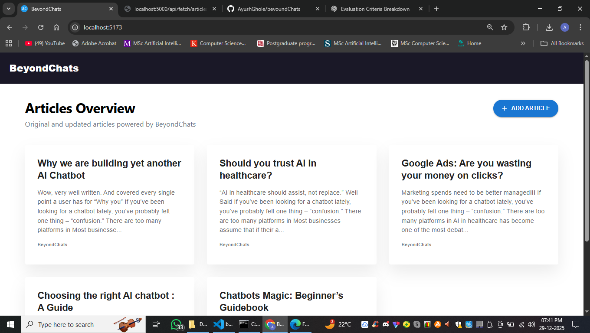

<h2>🚀 BeyondChats Blog Scraper & Article Management System </h2>
 

A full-stack application that scrapes the oldest blog articles from BeyondChats, stores them in a database, and provides a modern UI to view original content and update articles seamlessly.  
 &nbsp; &nbsp; &nbsp;  | <b>"Built with a focus on clean architecture, production-ready deployment, and a smooth developer experience"</b>.

 
<h2>✨ Key Highlights</h2> 
 
o ✅ Scrapes the 5 oldest articles from BeyondChats blogs  
o ✅ Stores structured article data in MongoDB 
o ✅ View original scraped article 
o ✅ Edit & update article content from the UI 
o ✅ Clean, modern UI using MUI + Framer Motion 
o ✅ Secure CORS-configured production deployment 
o ✅ Deployed on Vercel (Frontend) & Render (Backend) 
o ✅ Built with frequent commits to reflect real-world development workflow 
 
 
<h2>🧠 Why This Project Matters</h2>
 
✔ Handles real pagination edge cases 
✔ Prevents duplicate content issues 
✔ Automates competitor research 
✔ Prepares structured input for LLMs 
✔ Mirrors how modern content teams operate 
  
<h2>🧠 Tech Stack</h2>   
  

 

 

 
 
 

 

 
<h2>🏗️ System Architecture</h2>
 

<strong>BeyondChats Blogs</strong>

│

▼

<strong>Pagination Scraper</strong> (Fetches Oldest Articles)

│

▼

<strong>MongoDB</strong> (Article Store)

│

▼

<strong>CRUD APIs</strong> (Express.js)

│

▼

<strong>Automation Script</strong> (Node.js)

│

▼

<strong>Competitor Discovery</strong> (Authority Sites)

│

▼

<strong>Content Scraping & Cleaning</strong>

│

▼

<strong>LLM-Ready Content Enhancement</strong> (Phase 3)

  
<h2>🔗 API Endpoints Overview</h2> 
 
<table>
  <thead>
    <tr>
      <th>Method</th>
      <th>Endpoint</th>
      <th>Description</th>
    </tr>
  </thead>
  <tbody>
    <tr>
      <td>POST</td>
      <td>/api/scrape</td>
      <td>Scrapes the oldest blog articles from BeyondChats and stores them in the database</td>
    </tr>
    <tr>
      <td>GET</td>
      <td>/api/fetch/articles</td>
      <td>Fetches all stored articles from the database</td>
    </tr>
    <tr>
      <td>GET</td>
      <td>/api/fetch/:id</td>
      <td>Fetches a single article by its unique ID</td>
    </tr>
    <tr>
      <td>POST</td>
      <td>/api/create</td>
      <td>Creates a new article manually via API or admin panel</td>
    </tr>
    <tr>
      <td>PUT</td>
      <td>/api/update/:id</td>
      <td>Updates an existing article using its ID</td>
    </tr>
    <tr>
      <td>DELETE</td>
      <td>/api/delete/:id</td>
      <td>Deletes a specific article by its ID</td>
    </tr>
  </tbody>
</table>
 
<h2>🖥️ Live Project Links</h2> 
 
o Frontend (Live UI):  
 <a href="https://beyound-chats-roan.vercel.app">👉 https://beyound-chats-roan.vercel.app</a>   
o Backend API:  
 <a href="https://beyoundchats-backend.onrender.com">👉 https://beyoundchats-backend.onrender.com</a>  
  
 <h2>⚙️ Local Setup Instructions</h2> 
 1️⃣ Clone the Repository  
 &nbsp; &nbsp; o git clone : https://github.com/AyushGhole/beyoundChats.git  
&nbsp; &nbsp;  o cd beyondChats   
 2️⃣ Backend Setup  
 &nbsp; &nbsp; o cd backend  
 &nbsp; &nbsp; o node/nodemon src/app.js 
 &nbsp; &nbsp; o Create a .env file  
 3️⃣ Frontend Setup 
 &nbsp; &nbsp; o cd frontend  
&nbsp; &nbsp;  o npm install 
&nbsp; &nbsp;  o npm run dev   
&nbsp; &nbsp;  o Frontend will run on: http://localhost:5173 
 
<h4>🔐 CORS & Production Configuration</h4> 
o Backend CORS is configured to allow only trusted origins:  
&nbsp; &nbsp; o Vercel production frontend 
&nbsp; &nbsp; o Localhost (development) 
This Ensurs :   
&nbsp; &nbsp; o Secure cross-origin requests 
&nbsp; &nbsp; o Production-ready deployment practices   
 
<h2>🎨 UI/UX Enhancements</h2> 
<ul>
 <li>Material UI for consistent design</li>
 <li>Framer Motion for smooth animations</li>
 <li>Loading states & disabled actions during API calls</li>
 <li>Clean modal-based article editing experience</li>
 <li>Responsive layout for better usability</li>
</ul>
 
<h2>📸 Screenshots</h2> 

 
 <h2>👨‍💻 Author</h2>
<b>Ayush Ghole</b>   
<b>Full-Stack Developer | MERN</b> 

<h3>Deployed Project Link : </h3>
 
  
   <h4>Demo Link : </h4> 
    
     
